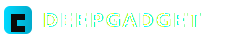

# GUI 목업

> 본 디렉터리는 **디자인 검증용 단일 HTML 목업**. 본 구현(SvelteKit)은 Phase 3에서 진행.

## 사용법

브라우저로 `index.html` 직접 열기:

```bash
xdg-open mockup/index.html        # Linux
open mockup/index.html             # macOS
```

또는 로컬 정적 서버:

```bash
cd mockup
python3 -m http.server 8000
# 브라우저: http://localhost:8000
```

## 동작

- **SPACE** 또는 **START 버튼** → mock 측정 시작 (10Hz로 합성 BW 데이터 발생)
- **STOP 버튼** → 정지
- 컨트롤 영역 클릭 → 값 순환 (드롭다운 단순화)

## mock 데이터 생성식

200G ConnectX-7 RoCE 환경 모사:
- BW: `187 + sin(2π · t/30) · 8 + gaussian_noise(σ=1.5)`, cap at 199
- LAT: uniform(1.5, 2.0) µs

> 실제 perftest 출력 분포는 실측 후 `tests/fixtures/`로 캡처해서 정확도 보강 예정.

## 의존성

- ECharts 5 (CDN: jsdelivr)
- GSAP 3 (CDN: jsdelivr)

본 구현 시 self-hosted로 변경 (폐쇄망 동작 보장).

## 회사 로고 교체

현재 `mockup/logo.svg`는 점선 박스 + "LOGO PLACEHOLDER" 텍스트 형태의 placeholder. 실 로고를 받으면 다음 중 하나로 교체:

**SVG (권장 — 벡터, 화면 비율 유지)**
```bash
# 받은 SVG 파일을 mockup/logo.svg로 덮어쓰기
cp /path/to/your-logo.svg mockup/logo.svg
```

**PNG**
```bash
# 1) PNG 파일을 mockup/logo.png 로 추가
cp /path/to/your-logo.png mockup/logo.png

# 2) mockup/index.html 의  을 logo.png 로 변경
sed -i 's|src="logo.svg"|src="logo.png"|' mockup/index.html
```

권장 크기: height 40px (헤더 표시 기준). 더 큰 원본은 자동 스케일됨. 흰색·밝은 색 톤이어야 다크 배경에 잘 보임.

본 구현 단계에서는 `frontend/static/logo.{svg,png}` 로 자산이 이동.

## 검증 항목

- [ ] 1080p 디스플레이에서 레이아웃 깨짐 없음
- [ ] 컬러 톤(흑백 + cyan)이 의도한 무드와 맞는지
- [ ] KPI 카운터 애니메이션 + 차트 업데이트 60fps
- [ ] 패킷 흐름 dot 모션이 자연스러운지
- [ ] 200G peak 도달 시 hot effect 동작 확인
- [ ] SPACE 단축키 동작
- [ ] 폰트(Inter / JetBrains Mono fallback) 가독성
- [ ] 회사 로고 자리(상단 좌측) 적정 크기

## 수정 사항 반영 절차

1. 사용자 검토 후 피드백 수집
2. `docs/ui-ux-spec.md`에 변경 사항 반영
3. 본 목업도 동기화 (또는 본 구현 시 적용)
